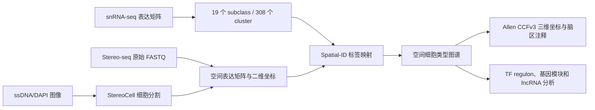

# Han et al.（2025）小鼠全脑单细胞空间转录组数据项目

本目录整理并分析论文 **Single-cell spatial transcriptomic atlas of the whole mouse brain**（Neuron，2025）对应的数据。它属于统一仓库 `spatial-omics-literature-data`，不是独立 GitHub 仓库。

## 研究对象与数据概况

- 论文 DOI：https://doi.org/10.1016/j.neuron.2025.02.015
- 原始数据：CNGB 项目 [`CNP0003837`](https://db.cngb.org/data_resources/project/CNP0003837)
- 处理后数据：[BSDC 数据 DOI](https://doi.org/10.12412/BSDC.1699433096.20001)
- 在线系统：[Mouse Brain Atlas](https://mouse.digital-brain.cn/spatial-omics)
- 成年小鼠全脑：Stereo-seq 与 snRNA-seq 联合构建
- 论文报告：29,655 个基因、超过 400 万空间细胞、308 个细胞簇
- 在线系统说明：mouse1 共有 123 张冠状切片，mouse2 共有 72 张，共 195 张
- snRNA-seq：378,287 个高质量细胞核、19 个 subclass、308 个 cluster
- 发育数据阶段：E12.5、E14.5、E16.5、P1、P7、P14、P77

## 当前仓库实际保存了什么

| 内容 | 是否在 GitHub | 说明 |
|---|---:|---|
| 数据清单、来源和状态 | 是 | 位于 `manifests/` |
| 下载与校验脚本 | 是 | 位于 `scripts/` |
| 环境配置 | 是 | `requirements.txt`、`environment.yml` |
| 5 个分析 Notebook | 是 | 位于 `notebooks/` |
| 合成小型测试数据 | 是 | 位于 `data/sample/`，不是真实论文数据 |
| 最小测试图 | 是 | 位于 `results/figures/` |
| FASTQ、TIFF、GEF、H5AD 等完整大文件 | 否 | 由 CNGB/BSDC 保存，按需下载到本地 |

CNGB 页面显示整个 `CNP0003837` 项目约 **125.58 TB**，包含 255 个样本、1168 个实验和 1168 个运行；官方说明由于体量巨大，只能直接下载部分数据，完整数据需联系 `datasubs@genomics.cn`。因此 GitHub 只保存索引和可复现工具，不复制大型数据。

## 数据之间的关系



Stereo-seq 负责回答“RNA 在组织切片的什么位置”；snRNA-seq 负责提供精细的细胞类型参考；Spatial-ID 将 snRNA-seq 的 308 个 cluster 映射到 Stereo-seq 细胞。两类数据不是同一种实验，也不能互相替代。

更详细的说明见 [docs/data_relationships.md](docs/data_relationships.md)。

## 快速开始

```powershell
cd papers\han-2025-mouse-brain-stereo-seq
python -m venv .venv
.\.venv\Scripts\Activate.ps1
python -m pip install -r requirements.txt
```

先预览官方明确给出直链的数据：

```powershell
python scripts\download_processed_data.py --dry-run
```

确认磁盘空间后下载：

```powershell
python scripts\download_processed_data.py --download
```

获取 CNGB 项目公开元数据、校验本地文件、运行最小测试：

```powershell
python scripts\download_raw_metadata.py
python scripts\verify_files.py
python scripts\run_minimal_test.py
```

## Notebook 用途

| Notebook | 用途 |
|---|---|
| `01_inspect_spatial_matrix.ipynb` | 读取长表表达矩阵，检查基因、细胞和 UMI |
| `02_inspect_cell_metadata.ipynb` | 查看细胞类型、脑区、切片和坐标字段 |
| `03_visualize_spatial_coordinates.ipynb` | 按基因表达量绘制二维空间散点图 |
| `04_compare_snRNAseq_and_stereoseq.ipynb` | 比较 Stereo-seq 聚合表达与 snRNA-seq 参考表达 |
| `05_visualize_3d_ccf_coordinates.ipynb` | 使用 CCF 样例坐标绘制三维细胞分布 |

启动 Jupyter：

```powershell
jupyter lab notebooks
```

## 数据清单与下载限制

- [manifests/datasets.csv](manifests/datasets.csv)：按数据类别记录模态、来源、accession、格式、大小状态和本地目录。
- [manifests/files.csv](manifests/files.csv)：只记录已确认的真实文件名、官方文件模式或明确的“未公布”。
- [docs/download_guide.md](docs/download_guide.md)：匿名下载、登录和申请步骤。

在线系统明确给出了：

- `stereoseq.celltypeTransfer.2mice.all.tsv.gz`：两只成年小鼠的 Spatial-ID 细胞类型映射。
- `section_id_used_in_paper.tsv`：平台切片编号与论文切片编号的对应表。
- `total_gene_T*.txt.gz`：每张切片的 DNB 基因表达和空间位置；这是官方公布的文件模式，不代表本仓库臆造了一组具体文件名。
- `regions-mouse*.tsv`：脑区编号说明文件模式；具体文件清单应从官方页面获取。

对于 BSDC/CNGB 未公开列出的文件，本仓库不会猜测名称、大小或直链。

## 许可证和引用

本目录中的代码采用 [MIT License](LICENSE)。论文数据不受本仓库 MIT 许可证覆盖，必须遵守 CNGB、BSDC、中国科学院脑科学数据中心和原论文规定的数据条款。

> Han L, et al. Single-cell spatial transcriptomic atlas of the whole mouse brain. *Neuron*. 2025;113(13):2141–2160.e9. https://doi.org/10.1016/j.neuron.2025.02.015

- CNGB：`CNP0003837`，https://doi.org/10.26036/CNP0003837
- BSDC：https://doi.org/10.12412/BSDC.1699433096.20001
- 在线系统：https://mouse.digital-brain.cn/spatial-omics

## 标签

`organism:mouse` · `tissue:brain` · `modality:stereo-seq` · `modality:snrna-seq` · `method:spatial-id` · `atlas:whole-brain` · `source:cngb` · `source:bsdc`
