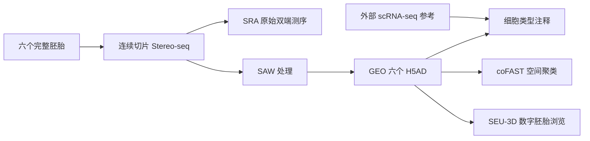

# Xie et al. (2025)：早期小鼠器官发生的完整数字胚胎

本目录是统一论文数据仓库中的一个独立、可复现数据项目，用于整理和分析 Xie 等人在 Cell 发表的完整小鼠胚胎空间转录组数据。它不会把大型数据复制进普通 GitHub，而是保存可审计的数据清单、下载工具、结构检查工具、Notebook 和测试结果。

## 论文与数据入口

- 论文：Xie et al. *Digital reconstruction of full embryos during early mouse organogenesis*. Cell 188, 4754–4772.e18 (2025)
- DOI：https://doi.org/10.1016/j.cell.2025.05.035
- GEO：https://www.ncbi.nlm.nih.gov/geo/query/acc.cgi?acc=GSE278603
- 处理后数据：https://ftp.ncbi.nlm.nih.gov/geo/series/GSE278nnn/GSE278603/suppl/GSE278603_RAW.tar
- BioProject：https://www.ncbi.nlm.nih.gov/bioproject/PRJNA1168072
- SRA：https://www.ncbi.nlm.nih.gov/Traces/study/?acc=PRJNA1168072
- SEU-3D：https://github.com/RainyBlue-w/SEU-3D
- coFAST：https://github.com/feiyoung/coFAST

## 研究对象和六个数据文件

研究对象是 E7.5、E7.75 和 E8.0 的完整小鼠胚胎，每个阶段有两个生物学重复，共六个处理后 H5AD。Cell 论文报告分析了 285 张连续切片；GEO 页面摘要仍写 360 张切片。仓库同时保留这两个来源口径，不擅自把它们改成同一个数字。

| 阶段 | 重复 | GEO | H5AD | GEO 报告大小 |
|---|---:|---|---|---:|
| E7.5 | 1 | GSM9046243 | `GSM9046243_Embryo_E7.5_stereo_rep1.h5ad` | 195.4 MB |
| E7.5 | 2 | GSM9046244 | `GSM9046244_Embryo_E7.5_stereo_rep2.h5ad` | 31.5 MB |
| E7.75 | 1 | GSM9046245 | `GSM9046245_Embryo_E7.75_stereo_rep1.h5ad` | 344.7 MB |
| E7.75 | 2 | GSM9046246 | `GSM9046246_Embryo_E7.75_stereo_rep2.h5ad` | 92.8 MB |
| E8.0 | 1 | GSM9046247 | `GSM9046247_Embryo_E8.0_stereo_rep1.h5ad` | 35.7 MB |
| E8.0 | 2 | GSM9046248 | `GSM9046248_Embryo_E8.0_stereo_rep2.h5ad` | 102.8 MB |

GEO 的 H5AD 是处理后的空间转录组对象；SRA 保存原始双端测序数据。论文用于细胞类型注释的 scRNA-seq 参考图谱是外部参考数据，不属于本文新产生的数据，因此本项目只记录其方法关系，不复制参考图谱。

## 数据之间的关系



- **SEU-3D** 是作者开发的三维网页浏览系统，用于查看数字胚胎中的区域化基因表达。
- **coFAST** 是加入空间信息的细胞聚类与显著性评估方法。
- H5AD 的真实轴方向、坐标键和注释字段必须由 `inspect_h5ad.py` 读取确认。GEO 文字写“行是基因、列是细胞”，但标准 AnnData 通常是 `obs × var`；本项目不根据网页文字提前假定。

## 快速开始

```powershell
cd papers\xie-2025-digital-mouse-embryo
conda env create -f environment.yml
conda activate xie-embryo-2025

# 只检查 URL，不下载
python scripts/download_geo_processed.py --check-url

# 实际下载约 802.8 MB 的官方 TAR，支持续传和重试
python scripts/download_geo_processed.py

# 安全解压六个 H5AD
python scripts/extract_geo_archive.py

# 逐文件读取实际结构，使用 backed='r'
python scripts/inspect_h5ad.py

# 启动 Notebook
jupyter lab notebooks
```

详细步骤见 [下载指南](docs/download_guide.md) 和 [H5AD 结构说明](docs/h5ad_schema.md)。

## Notebook 用途

1. `01_data_inventory.ipynb`：六个样本、阶段、重复、大小和下载状态。
2. `02_inspect_h5ad.ipynb`：解释 `X`、`obs`、`var`、`obsm`、`uns`、`layers`。
3. `03_visualize_spatial_coordinates.ipynb`：自动寻找二维或三维坐标并绘图。
4. `04_visualize_marker_expression.ipynb`：尝试 Myl7、Tnnt2、Mef2c、Shh、Cer1、Apela。
5. `05_compare_developmental_stages.ipynb`：比较阶段间细胞数、基因数、注释组成和 marker。

Notebook 不硬编码未经验证的字段；它们读取 `h5ad_summary.csv` 或调用自动识别函数。

## GitHub 中保存什么

GitHub 保存：中文文档、CSV 清单、下载与校验脚本、Notebook、可复现测试代码和小型结果图。以下大文件被 `.gitignore` 排除：TAR、H5AD、FASTQ、SRA、BAM、GEF、GEM 和 TIFF；完整数据留在 GEO/SRA。

当前没有提交来源于 GSE278603 的样例 H5AD：虽然数据公开且不涉及人类敏感信息，但 GEO 页面未单独给出可再分发的数据许可证。`create_sample_data.py` 只有在用户显式确认许可后才会生成可提交样例。

## 当前下载状态

2026-08-19 在本机实际尝试访问官方 HTTPS、HTTP、FTP 和内置浏览器下载通道，分别遇到 `SSL/TLS connection failed`、`Empty reply from server`、`response reading failed` 和 `ERR_CONNECTION_CLOSED`。因此本次提交不声称已经下载或检查真实 H5AD；清单中的 SHA256 与 shape 保持空白，并把失败状态明确记录。脚本已完整保留，网络恢复后可续传。

仓库当前提交的 `results/figures/`、`results/tables/` 和 `synthetic_validation.json` 只证明分析流程能够运行，全部来自明确标注的合成测试对象，不是论文数据的生物学结果。

## 引用与许可

使用数据时请同时引用论文 DOI、GEO `GSE278603`、BioProject `PRJNA1168072`；使用 SEU-3D 或 coFAST 时另按各自仓库要求引用。

本目录的代码和原创文档按 `LICENSE` 中的 MIT 条款提供。论文、GEO/SRA 数据、SEU-3D 和 coFAST 保留各自许可证；本仓库不替作者重新授权数据。
